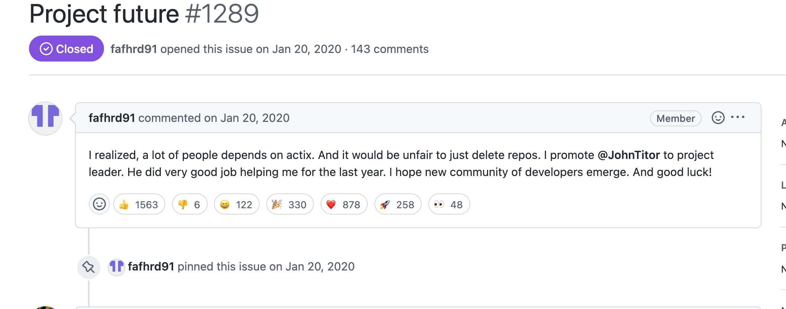

1: Introduction

* Actix is a popular web framework written in Rust that provides a fast and reliable server-side application framework. It was first released in 2017 by Nikolay Kim and has since then been used by many Rust developers.
* Initially, Actix was built upon the Actor model which is a concurrency model that allows for efficient and fault-tolerant distributed systems. However, in 2019, the creator of Actix, Nikolay Kim, announced that he would no longer be maintaining the project due to disagreements with the Rust community over licensing issues.
* Following this announcement, a new community-driven fork called "Actix Web" was created in early 2020. Actix Web aims to provide a similar API to the original Actix framework while being more community-driven and having a more permissive license. 
> See the link to [github issue](https://github.com/actix/actix-web/issues/1289)


* Actix Web has quickly gained popularity within the Rust community due to its performance, simplicity, and ease of use. It is actively maintained and has a growing ecosystem of third-party libraries and plugins.
* Actix is a Rust web framework for building highly concurrent and performant applications
* One of its key features is the ability to map URLs (routes) to functions and parameters
* This allows you to create custom endpoints for your application that can handle specific requests and return specific responses

2: Defining routes in Actix

* Routes are defined using the route method provided by Actix
* This method takes two arguments: a URL path and a handler function
* The URL path is a string that defines the endpoint for the route, while the handler function is the code that will be executed when the route is called

* Example: 
  * `App::new().route("/hello", web::get().to(hello_world))` or
     ```rust 
     App::new()
       .service(service_one)
       .service(service_two)
    ```

2.1: Handling parameters in routes

* Actix allows you to handle parameters in your routes using the `web::Path` and `web::Query` structs
* `web::Path` is used for handling parameters in the URL path, while `web::Query` is used for handling query string parameters
* Example: 
  * ```App::new().route("/user/{id}", web::get().to(get_user))```
  (In this example, the id parameter is handled using `web::Path`)

2.2: Handler Functions
* Handler functions are the code that is executed when a route is called
* They can take arguments, such as web::Path and web::Query, to handle parameters passed in the request
* Example:  

  ```rust 
  #[get("/person")]
  async fn person_route_querry(query: web::Query<PersonQuery>) -> HttpResponse {
    let result = format!(
        "route query params are, name{} {} {}",
        query.name, query.location, query.age
    );
    HttpResponse::Ok().body(result)


3. Datastructures and Traits:


* `HttpRequest`: This is a data structure that represents an HTTP request in actix-web. It contains information about the HTTP method, headers, URL, and other metadata related to the request. [docs](https://docs.rs/actix-web/latest/actix_web/struct.HttpResponse.html)

* `HttpRequest`: This is a data structure that represents an HTTP response in actix-web. It contains the response status code, headers, and body. [docs](https://docs.rs/actix-web/latest/actix_web/struct.HttpRequest.html)

* `Route`: This is a trait that defines how to match an HTTP request to a particular handler function. It is used to define the URL path and HTTP method for a particular handler function. [docs](https://docs.rs/actix-web/latest/actix_web/struct.Route.html)

* `Hander`: This trait is used to define the behavior of request handlers in Actix web. It is implemented by functions or closures that take a request as input and return a response.

* `Responder`: This trait is used to define the behavior of response objects in Actix web. It is implemented by types that can be converted into an HTTP response.

* `Middleware`: This trait is used to define the behavior of middleware in Actix web. It is implemented by types that can intercept requests and responses and modify them before passing them on to the next middleware or request handler.

* `Service`:  This trait is used to define the behavior of services in Actix web. It is implemented by types that can handle multiple requests and responses, and can be shared across multiple threads or workers.

4. Protected Routes (The Theory :-P)
* `Guard`: One 

----
-----
CONCLUSION
* Actix provides a powerful and flexible way to map URLs (routes) to functions and parameters
* This allows you to create custom endpoints for your application that can handle specific requests and return specific responses
* By using web::Path and web::Query, you can handle parameters passed in the request and use them in your handler functions.